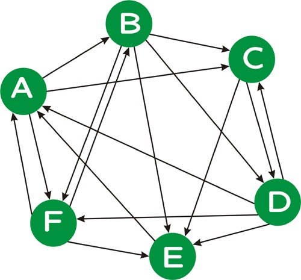

#PageRank

In this assignment, you will compute PageRank on a collection of 183,811 web documents. Consider the version of PageRank described in class. PageRank can be computed iteratively as show in the following pseudocode:    

```
// P is the set of all pages; |P| = N
// S is the set of sink nodes, i.e., pages that have no out links
// M(p) is the set (without duplicates) of pages that link to page p
// L(q) is the number of out-links (without duplicates) from page q
// d is the PageRank damping/teleportation factor; use d = 0.85 as a fairly typical value

foreach page p in P
  PR(p) = 1/N                          /* initial value */

while PageRank has not converged do
  sinkPR = 0
  foreach page p in S                  /* calculate total sink PR */
    sinkPR += PR(p)
  foreach page p in P
    newPR(p) = (1-d)/N                 /* teleportation */
    newPR(p) += d*sinkPR/N             /* spread remaining sink PR evenly */
    foreach page q in M(p)             /* pages pointing to p */
      newPR(p) += d*PR(q)/L(q)         /* add share of PageRank from in-links */
  foreach page p
    PR(p) = newPR(p)

return PR
```

In order to facilitate the computation of PageRank using the above pseudocode, one would ideally have access to an in-link respresentation of the web graph, i.e., for each page p, a list of the pages q that link to p.

Consider the following directed graph:

We can represent this graph as follows:    
```
A D E F
B A F
C A B D
D B C
E B C D F
F A B D
```
where the first line indicates that page A is linked from pages D, E, and F, and so on. Note that, unlike this example, in a real web graph, not every page will have in-links, nor will every page have out-links.

